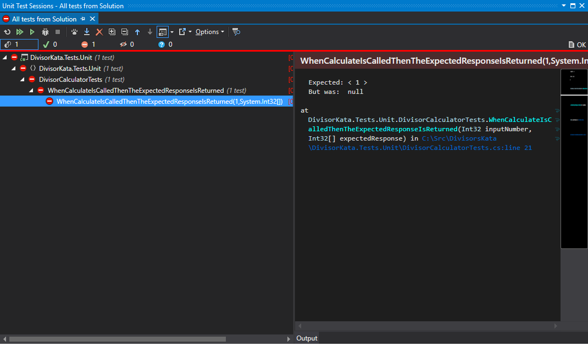

# DivisorsKata
Red green refactor coding exercise.

## This repository
Within this repository you will find a solution `DivisorsKata.sln` this solution contains 2 projects 
- `DivisorsKata` 
Project containing 1 class `DivisorCalculator` with a calculate method (where the main logic will go).
- `DivisorsKata.Tests.Unit`
Project containing 1 class that has tests for the `DivisorCalculator`

### Current state
Currently the project should build but contains 1 failing test.

## The Task
This task should be undertaken in pairs.
The aim of this task is to create a function that when passed a whole positive integer will return all of the integers that the number can be divided by for instance passing `1` will return `[1]` and passing `64` will return `[1, 2, 4, 8, 16, 32, 64]` 

This task should be performed using [red green refactor](http://www.jamesshore.com/Blog/Red-Green-Refactor.html). Where the first person will fix any failing tests making the minimum code change required. they will then write 1 failing test and recommit the code where it can then be picked up by the other member of the pair.
 
